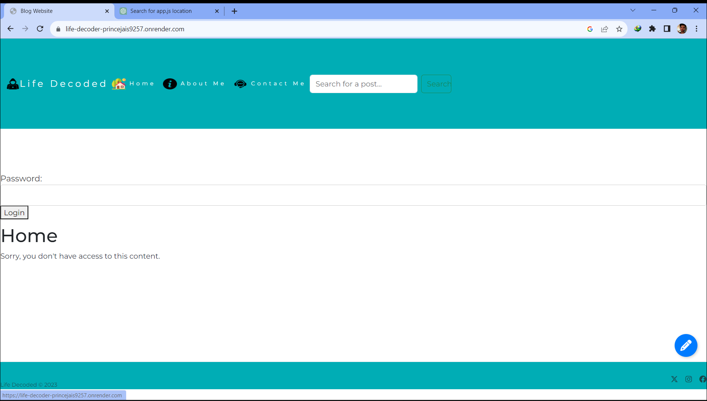
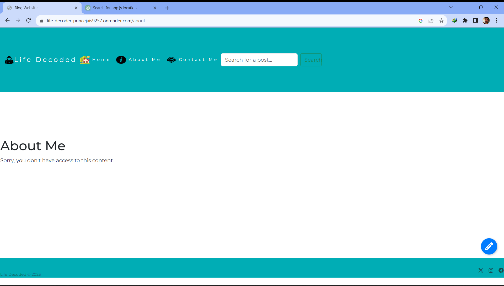
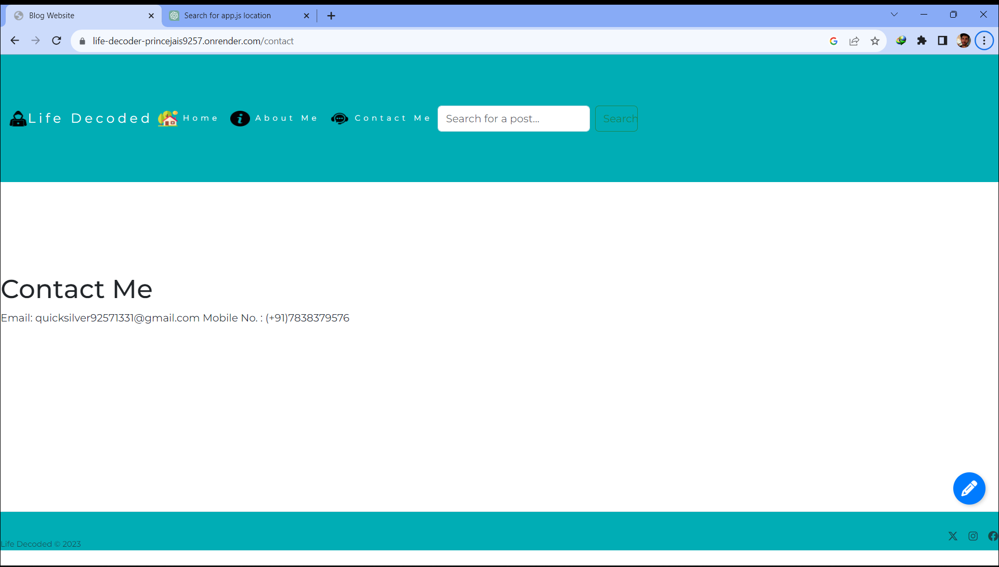
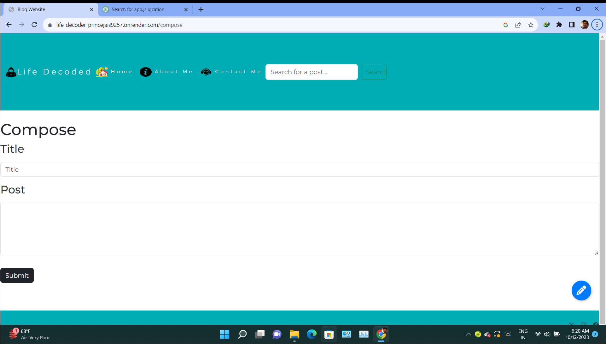

# Life Decoder

Welcome! This website was developed to provide college students with a platform for various academic and social activities. It incorporates HTML, CSS, JavaScript, jQuery, Bootstrap, and Node.js to create a dynamic and interactive user experience.

## Features

- **User Registration and Authentication**: Secure user registration and login system to protect sensitive information.

- **Student Profile**: Each student can create and manage their profile, including personal information and academic details.

- **Course Management**: Allows students to view and enroll in courses, check schedules, and access course materials.

- **Events and Announcements**: Keep students informed about upcoming events, news, and important announcements.

- **Discussion Forums**: Students can participate in academic discussions and ask questions.

- **Social Networking**: An integrated social platform for students to connect, share updates, and build a community.

- **Responsive Design**: The website is designed to work on various devices, ensuring a seamless experience for all users.

- **Search Functionality**: Allows users to search for courses, events, and other users easily.

## Technologies Used

- HTML
- CSS
- JavaScript
- jQuery
- Bootstrap
- Node.js
- MongoDB
- Express.js

   
## Screenshots






## Demo

Check out a live demo of Life_Decoder [here](https://life-decoder-princejais9257.onrender.com)!

## Setup

To run this project locally, follow these steps:

1. Clone this repository to your local machine.

   ```bash
   git clone https://github.com/YuvrajJais9257/Life_Decoder.git

2. Install Node.js and npm (Node Package Manager) if not already installed on your system.
3. Install project dependencies by running the following command within the project directory:

   ```bash
   npm install
4. Start the Node.js server:
    ```bash
    node server.js
5. Open your web browser and visit http://localhost:3000 to access the website.

## Contributing 

If you'd like to contribute to this project, please follow these guidelines:
1. Fork the repository.
2. Create a new branch for your feature or bug fix.
3. Make your changes and ensure the code style is consistent.
4. Test your changes thoroughly.
5. Submit a pull request with a clear description of your changes.

## Contact 

If you have any questions or feedback, feel free to reach out to us at [here](quicksilver92571331@gmail.com)!.
